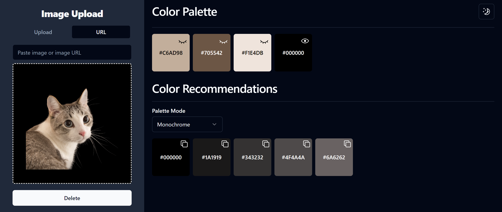

# Palette Town

Palette Town is a web application that helps you generate color palettes for your next design project. Simply upload an image or provide a URL to an image, and Palette Town will analyze the colors and give you a range of color palette recommendations to choose from. You can also specify the type of color palette you want (monochrome, triad, analogic, etc.) and the app will generate a custom color scheme for you. Use Palette Town to inspire your next design, whether you're a professional designer or just starting out.

## Screenshots

## Tools
1. [Svelte](https://svelte.dev/)
2. [The Color Api](https://www.thecolorapi.com/)

### Todos
1. Allow users to tweak the color extraction settings
2. Create section that allows users to visualize color recommendations on sample components